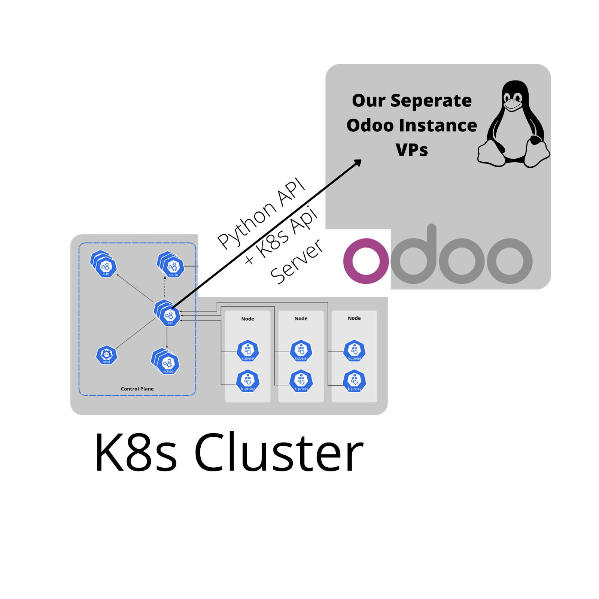
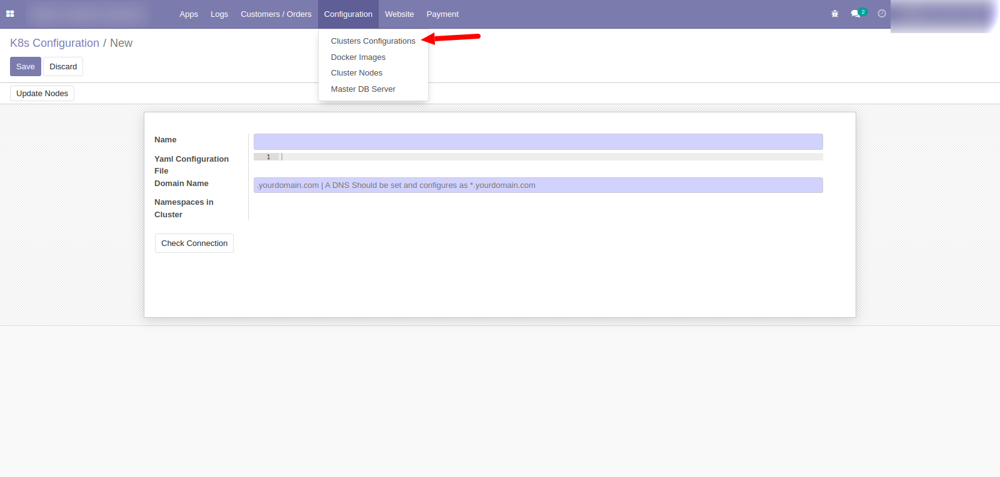
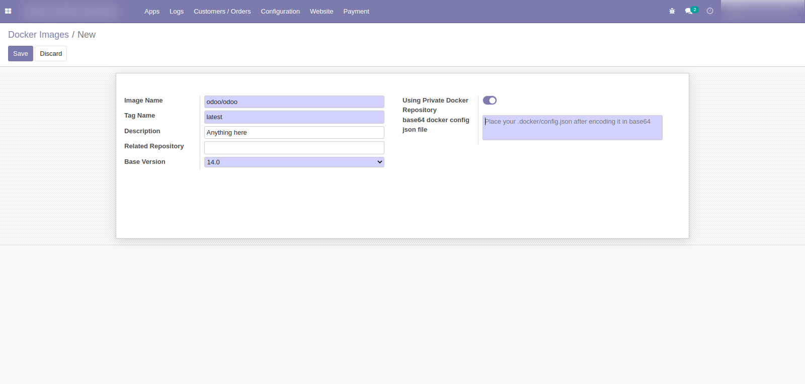
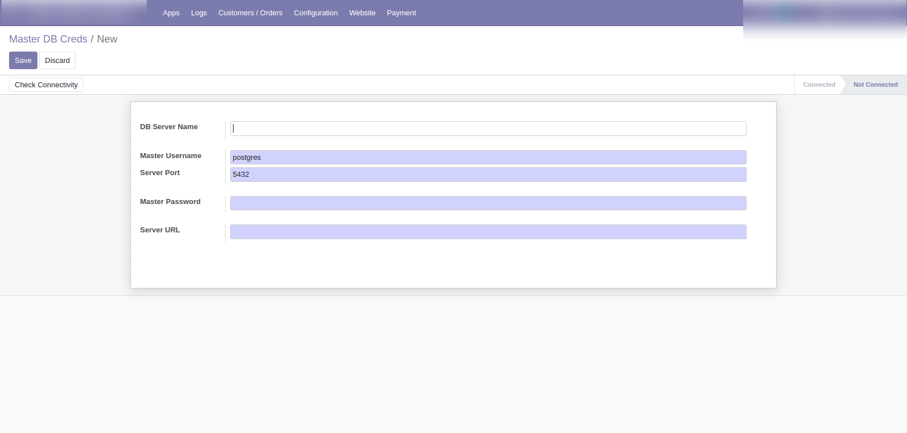
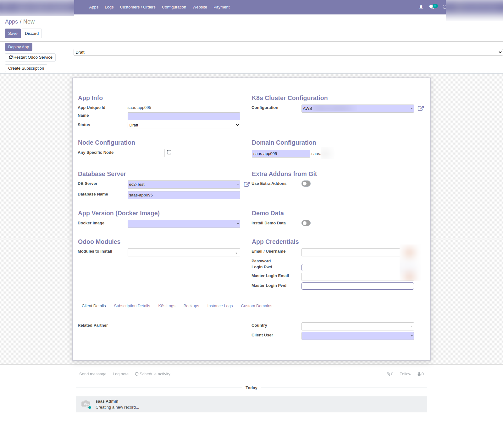

# Welcome to Odoo SaaS on K8s documentation!

## Architecture

There are two main sections of the system

1. Kubernetes Cluster
2. Manager Instance

## 1. Kubernetes Cluster

In Kubernetes Cluster we will have all essential parts of K8s cluster that are required to run a cluster in production 

- Load Balancer 
- cluster
- Nodes
- PVs

For detailed configuration of k8s cluster on digitalocean [click here](k8s_cluster.md), for aws (will be added later)

## 2. Manager Instance

It is a separate, VPS server 

On manager instance we will install Odoo and these modules, currently odoo version 14.0 is supported, i have created a task to migrate these modules for latest (v17.0) of odoo

Your Cluster should be accessible from this instance.

Once you are able to access your cluster within your saas-manager-instance using kubectl

### Step 1 (Cluster Configuration):

Click Configuration -> Cluster Configurations and create a new cluster

We can manage multiple clusters from 1 manager instance

in name field add anything you want to name your cluster

Yaml Configuration file, copy and paste the kubeconfig.yaml 

domain name is the domain which is attached and pointed to your k8s cluster / LoadBalancer DNS, it should be pre configured, write it as .yourdomain.com

then click on “Check Connection” , it should list all the namespaces of your cluster , it is just a method to check if we are good to go

### Step 2 (Docker Images Configuration):

You can also use your private docker images hosted on [Docker Hub](https://hub.docker.com/) or public [odoo’s official docker images](https://hub.docker.com/_/odoo) to deploy your Odoo instance

in “Image Name” field you have to write the image name e.g bitnami/odoo , username/odoo, etc.

other fields are self explanatory 

if your docker images are on private registry then place the “.docker/config.json” file here

more info [here](https://docs.docker.com/reference/cli/docker/config/)

### Step 3 (Database server):

You have to deploy a Separate VPS for and install and configure postgres on it , or can use managed DB service from DigitalOcean or AWS

read the guide [here](db_server.md) 

then check connectivity if you are able to connect from “Manager Instance” to the db server, 

this db server will host all the client databases

### Step 4 (Create App/Instance):

1. `Unique id` is the id of instance, dont change it in any case

2. `Name`, write any name

3. choose `sub domain` as per your requirement

4. if you want to deploy this client on a specific Node of K8s cluster then check “Any Specific Node” otherwise leave it as it is

5. choose Database server

6. `Database name` will be the name of db, but `sub domain name and database name should be same`

7. if you want to use `extra addons from github`, check the box and enter url, like this “https://github.com/OCA/account-financial-tools.git“ 

8. if the repo is private then you have to place the `access token` also, more info [here](https://docs.github.com/en/authentication/keeping-your-account-and-data-secure/managing-your-personal-access-tokens) 

9. Choose the `docker image`

10. if you want to install the `demo data` also then check the box

11. leave `Modules to Install` empty

12. Leave the `App Credentials` empty, these will be automatically populated after the instance goes live

13. Client user is the user, to whom you want to notify about this instance and creds, you should have configured smtp in your manager instance

Save and click on **Deploy App**