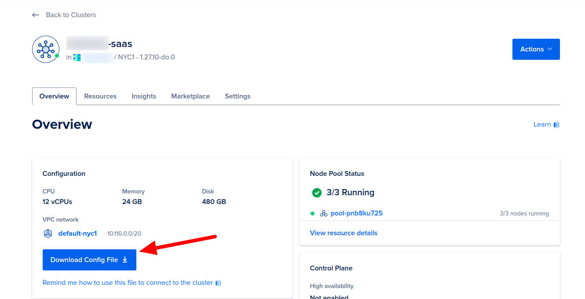
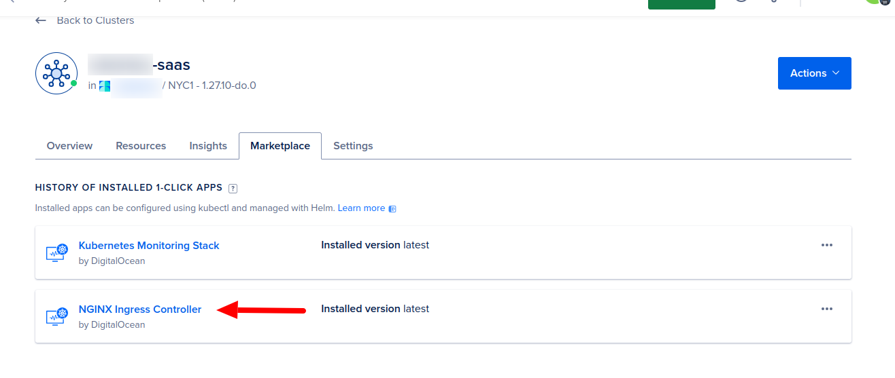
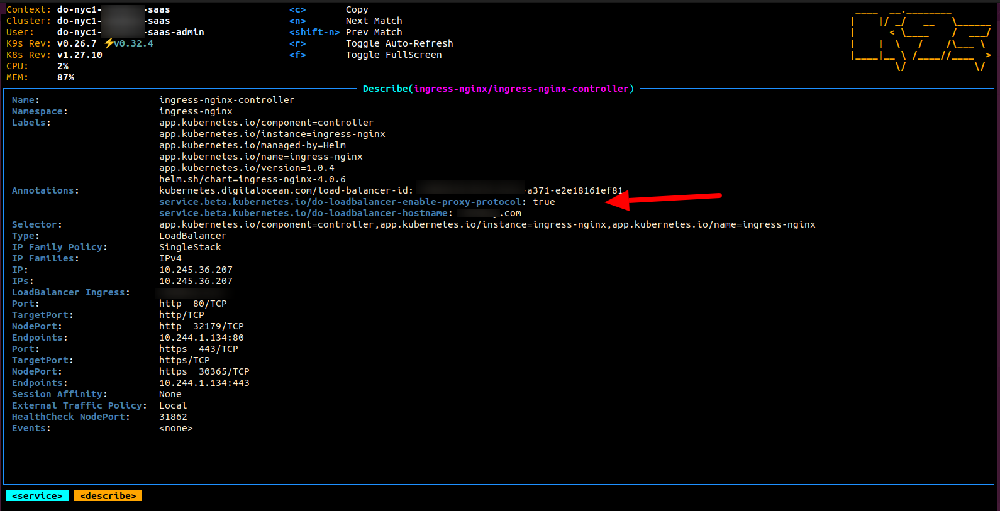

# Kubernetes Cluster Setup

!!! note

    Following guide will be based on DigitalOcean Managed Kubernetes (DOKS) 

Create a cluster and add node(s) in the cluster on DO,

1. Install Nginx ingress controller in the cluster, with app installer
2. Then loadbalancer will be provisioned automatically

After pointing the domain to LB’s DNS and installing nginx ingress controller

edit the LoadBalancer service (ingress-nginx/ingress-nginx-controller) using any tool, i am using k9s

Add this

    kubernetes.digitalocean.com/load-balancer-id: {id_of_lb_here}
    service.beta.kubernetes.io/do-loadbalancer-enable-proxy-protocol: 'true'
    service.beta.kubernetes.io/do-loadbalancer-hostname: yourdomain.com 
 

Install cert-manager and ssl issuer. as per following guides

[https://github.com/cert-manager/cert-manager](https://github.com/cert-manager/cert-manager)

[https://kenanbek.github.io/kubernetes-https-nginx-ingress-cert-manager-digitalocean](https://github.com/cert-manager/cert-manager)

[https://cert-manager.io/docs/installation/](https://github.com/cert-manager/cert-manager)